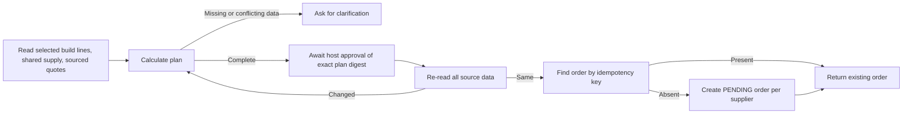

# InvenTree procurement agent skeleton

This example includes an **offline-verified Agent prototype** and a **native InvenTree plugin for read-only procurement facts**. In an isolated InvenTree instance, a non-superuser read-only procurement role created an analysis task from one real test Build and viewed sourced BuildLine, Part, and scoped-stock facts. Authentication, CSRF, business-role checks, owner-only reads, and persistence after restart were verified. The optional DeepSeek explanation endpoint and UI were also exercised with real `deepseek-flash` calls through the read-only snapshot tool, including a full browser creation and generation flow. The separate GET-only REST adapter has not been run against that instance. No durable approval or purchase order write has been completed. The implementation is limited to this example directory.

## Native plugin milestone

The user chose an InvenTree plugin as the first integration path. `plugin/backend/` contains the installable Python package, durable task model, analysis-task creation endpoint, and read-only preview endpoint. `plugin/frontend/` contains the purchasing-page panel. [The first integration record](docs/integration_spike.md) gives the isolated Docker setup; [milestone 2 validation](docs/milestone2_integration_validation.md) records real data, HTTP, permission, restart, and browser results. [The decision record](docs/architecture_decisions.zh-CN.md) explains the tradeoffs; [the interview notes](docs/interview_notes.zh-CN.md) separate verified work from proposed capabilities. The panel shows one Build's demand lines and one stock value per Part, with sources and warnings.

The optional explanation endpoint uses `ChatDeepSeek` with `create_deep_agent` and a single task-bound snapshot tool. It caches successful explanations by snapshot digest and keeps model text separate from deterministic facts. The [DeepSeek validation record](docs/milestone3_deepseek_integration_validation.md) reports the live checks and remaining gaps. Supplier quotes remain unconnected.

## Flow



`procurement.py` defines `ProcurementGateway`, `Snapshot`, `Plan`, and `ProcurementWorkflow`. A host adapter must normalize each selected build line's *outstanding* requirement after consumed and allocated quantities. It must expose `free_stock` and confirmed `incoming` **once per part across the selected builds**, after excluding supply committed elsewhere. This avoids adding the same stock once per build. These are proposed adapter contracts; they are not verified mappings to live InvenTree fields. Quantity arithmetic uses `Decimal`: it converts stock-unit shortage to supplier order units using `stock_units_per_order_unit`, rounds to `order_multiple`, and selects the lowest total extended price among current quotes in one currency. `PlanLine.quantity` is in supplier order units for the purchase order line API. Both conversion and multiple must have verified provenance; the current InvenTree serializer does not expose the model's `multiple` field. The prototype does not calculate exchange rates, infer lead time, or treat missing quotes as zero price.

## REST adapter boundary

`inventree_adapter.py` provides `InvenTreeReadAdapter` and a GET-only `UrllibJsonTransport`. Supply a base URL, token transport, `supply_resolver`, and `quote_resolver`. The adapter verifies each selected build with `/api/build/{pk}/`, then reads paginated `/api/build/line/`, part detail and requirements, exact-part stock with `include_variants=false`, active supplier parts, and price breaks. It rejects 401/403, malformed fields, mismatched IDs, changed pagination filters, cross-origin pagination, and timeouts without automatic retry.

For each build line, `outstanding = quantity - consumed - allocated`. It does **not** deduct `in_production` or `on_order` because those annotated fields represent broader part supply rather than supply assigned to that specific line. The `supply_resolver` must determine shared `free_stock` and `incoming` once per part from the raw part, requirements, and stock responses, accounting for locations, other commitments, and selected builds. The `quote_resolver` receives the remaining shortage in stock units, selects a price tier, and adds independently verified quote expiry, order multiple, and provenance. The adapter checks its supplier, part, `pack_quantity_native`, price, and currency against REST records. Neither callback has a built-in production implementation; constructing the adapter requires both. Thus the GET client alone cannot produce an approved purchasing plan.

`format_draft_requests` constructs inspectable purchase order and line templates. The order template has `reference` and `supplier`; each line template has SupplierPart `part`, supplier-order-unit `quantity`, explicit price/currency, `merge_items:false`, and `auto_pricing:false`. The line `order` ID is unavailable until an order exists. The function sends nothing and does not reserve a reference. `InvenTreeReadAdapter.find_complete_pending_order` and `create_pending_order` always raise `WriteDisabled`; no POST method exists on its transport. A timeout or unknown write result must be reconciled by a future durable execution ledger and line-by-line readback before enabling writes.

`agent.py` exposes `create_procurement_agent(model, workflow, checkpointer)`. The host provides a real LangChain model and a LangGraph checkpointer. Deep Agents receives three tools:

| Tool | Action |
| --- | --- |
| `inspect_inputs` | Read normalized build needs, shared supply, and quote provenance. |
| `propose_plan` | Recalculate the plan and invalidate any prior approval. |
| `create_pending_drafts` | After host approval, re-read inputs and create one PENDING draft per supplier. |

The write tool also has a Deep Agents human interrupt. This is a second UI pause, not a substitute for `ProcurementWorkflow.approve(plan_digest, approver)`. Only an authenticated host action may call `approve`; the model has no approval tool. The host must show the complete plan, source references, snapshot digest, and approver identity before accepting approval. `create_pending_drafts` rejects an absent or stale approval even if the model calls it. A fresh quote expiry check is included when creating drafts.

The gateway's `find_complete_pending_order(idempotency_key)` and `create_pending_order(...)` are abstract methods. The lookup may return an order only after verifying its PENDING status and all approved lines. An InvenTree adapter must check purchase permissions, generate a valid unique `reference`, verify the default `PENDING` status, create line items using supplier part IDs and supplier order-unit quantities, and read back order status and contents. The current API has no native idempotency key: the adapter must store a durable key-to-reference mapping and make lookup reliable across process restarts. If a create response is uncertain, this workflow looks up the key before reporting failure; the adapter must never issue a blind retry. InvenTree's purchase order POST and line POSTs are separate operations. This prototype does **not** implement line-by-line recovery from a partially created order, so its abstract `create_pending_order` contract cannot be considered production-safe until that recovery and verification exist. Multi-supplier execution can also partially succeed; the host must reconcile and display results per supplier. See [the source-checked API contract](docs/inventree_api_contract.md) for request fields and remaining validation work.

The in-memory plan, approval, and order map are intentionally not production persistence. A deployed plugin needs authenticated endpoints, durable task and approval records, authorization checks at approval and write time, verified supply and quote policies, line-by-line recovery, and validation against a running pinned InvenTree version. No such integration is claimed here. See [the preflight review](docs/preflight.md) for the field and plugin gaps that remain open. The source review used InvenTree commit `967f7a55d1b27a0536273e02f99ff974db4ee22d`; that checkout is not bundled in this example.

The [evaluation plan](docs/evaluation_plan.md) and [18 synthetic cases](docs/fixtures/procurement_eval_v1.json) describe how to compare the existing purchase wizard, deterministic rules, and this agent. No comparative scores have been measured yet.

## Offline verification

From the `deepagents/` root:

```bash
python3.11 -m unittest discover -s examples/inventree-procurement-agent/tests -v
```

The test gateway and HTTP responses are synthetic. Tests cover shared stock aggregation, packaging and total price choice, missing quotes, explicit approval, changed inputs, quote expiry, repeated execution, a lost create response in the fake gateway, REST pagination and filters, permissions, timeouts, field mapping, and disabled writes. No network, model credentials, or InvenTree installation are needed.
