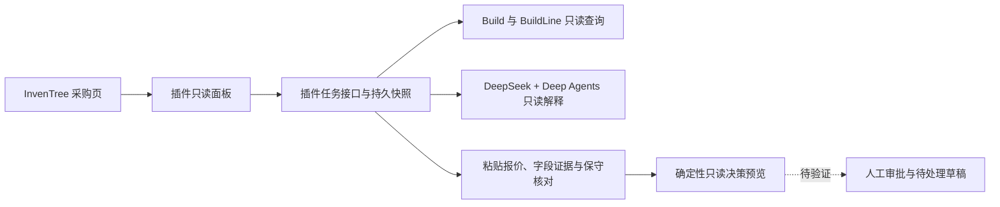

# 采购 Agent：面试讲解提纲

## 一分钟说明

“我以 InvenTree 的生产单采购为场景，做了一个可审计的采购分析 Agent。原生插件在隔离实例跑通真实数据只读预览：测试单两条同物料需求 4 和 6，可用库存 5 只计一次，初步缺口为 5。我验证了普通采购查看角色、CSRF、任务归属和重启恢复。用户再粘贴一份匿名报价，DeepSeek 通过任务绑定的只读工具抽取字段，服务端核对原文位置，并标出与 SupplierPart 的冲突或待核实项。十五个合成报价各跑三次，通过 44/45；不合格的模型结果被拒绝。最后由确定性代码生成只读决策预览，列出在途、单位换算和价格档位等阻断项，订货数量与总价保持空值，采购单写入仍关闭。”

说完后按实际情况展示：[设计决策](architecture_decisions.zh-CN.md)、[第二阶段联调](milestone2_integration_validation.md)、[第三阶段联调](milestone3_deepseek_integration_validation.md)、[报价联调与评测](milestone4_quote_eval_v1_report.zh-CN.md)、[扩大评测与失败归因](milestone5_quote_eval_v2_report.zh-CN.md)、[只读决策预览](milestone6_decision_preview.zh-CN.md)。演示前先核对这些文件中的最新结果。

## 架构图

实线表示已经在隔离实例跑通的插件路径；虚线表示下一阶段目标。当前不能把原型里的模拟采购单说成真实 InvenTree 写入。

## 面试官常问的四个问题

| 问题 | 回答要点 |
| --- | --- |
| 为什么用 Agent？ | 原采购向导已经能算部分缺口。当前模型处理的是用户粘贴的非结构化报价；规则程序负责权限、金额与证据核验。单份短文本不需要 RAG。后续若接多附件、跨文档检索，再验证检索增益。 |
| 为什么先做原生插件？ | 采购人员在现有页面核对任务和权限。先验证 InvenTree 的 UI、URL、数据库扩展点；如果模型运行拖慢主服务，再拆出模型服务，但保留插件作为身份和审批入口。 |
| 怎样防止模型乱买？ | 模型没有批准权限；服务端绑定方案摘要与数据快照，写前重新读取，关键数量用 `Decimal` 计算。真实写入目前关闭，直到持久幂等和部分订单行恢复通过测试。 |
| 怎样证明项目有效？ | 先冻结七条合成案例和历史结果，再扩成十五条、每条重复调用三次。最新版本 44/45，余下一次证据元数据校验失败并被拒绝；这是合成测试，不代表生产准确率。尚无真实匿名报价集，也未与现有采购向导做完整对比。 |

## 如实说明边界

第二阶段插件已显示一张真实测试生产单的需求行、按 Part 去重的库存、初步缺口、来源和警示。第三阶段真实 DeepSeek 调用、工具执行证据、HTTP 权限与缓存、浏览器生成和重启读取已在隔离实例验证。第四阶段接入了手工粘贴的匿名供应商报价，并完成真实 HTTP、浏览器和 7×3 合成评测。第五阶段把评测扩至 15×3，并记录固定失败类别；只有明确标签且同语义的无单位包装量才直接比较。第六阶段接入了只读决策预览，逐 Part 显示初步缺口、关联报价和阻断原因，订货数量与总价保持未知。价格档位、其他包装单位换算、交期与有效期的业务核对仍需人工确认；附件、RAG、审批和采购单写入未接入。单例正确不代表模型对所有生产单都准确，也没有测量与现有采购向导的完整对比成绩。具体证据见[第二阶段联调](milestone2_integration_validation.md)、[第三阶段联调](milestone3_deepseek_integration_validation.md)、[第四阶段评测](milestone4_quote_eval_v1_report.zh-CN.md)、[第五阶段评测](milestone5_quote_eval_v2_report.zh-CN.md)和[第六阶段联调](milestone6_decision_preview.zh-CN.md)。
