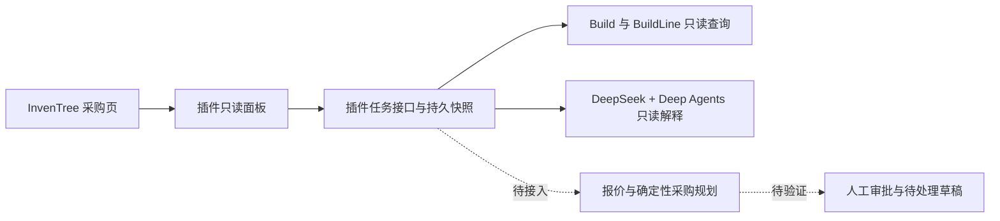

# 采购 Agent：面试讲解提纲

## 一分钟说明

“我以 InvenTree 的生产单采购为场景，做了一个可审计的采购分析 Agent。原生插件在隔离实例跑通真实数据只读预览：测试单两条同物料需求 4 和 6，可用库存 5 只计一次，初步缺口为 5。我验证了普通只读角色、CSRF、任务归属和重启恢复。DeepSeek 只能通过当前任务绑定的只读工具读取事实快照；真实 API 调用和浏览器生成均已跑通，并保存工具调用 ID 与结果哈希。报价理解、审批和采购单写入仍待实现。”

说完后按实际情况展示：[设计决策](architecture_decisions.zh-CN.md)、[第二阶段联调](milestone2_integration_validation.md)、[第三阶段联调](milestone3_deepseek_integration_validation.md)、[测试案例](evaluation_plan.md)。演示前先核对这些文件中的最新结果。

## 架构图

实线表示已经在隔离实例跑通的插件路径；虚线表示下一阶段目标。当前不能把原型里的模拟采购单说成真实 InvenTree 写入。

## 面试官常问的四个问题

| 问题 | 回答要点 |
| --- | --- |
| 为什么用 Agent？ | 原采购向导已经能算部分缺口。Agent 的候选价值是跨生产单查询、理解报价附件、指出来源冲突并向人澄清。需要和原向导、规则程序用同一批案例比较，不能预设 Agent 更好。 |
| 为什么先做原生插件？ | 采购人员在现有页面核对任务和权限。先验证 InvenTree 的 UI、URL、数据库扩展点；如果模型运行拖慢主服务，再拆出模型服务，但保留插件作为身份和审批入口。 |
| 怎样防止模型乱买？ | 模型没有批准权限；服务端绑定方案摘要与数据快照，写前重新读取，关键数量用 `Decimal` 计算。真实写入目前关闭，直到持久幂等和部分订单行恢复通过测试。 |
| 怎样证明项目有效？ | 记录现有采购向导、规则程序、Agent 三组的完成率、错误写入、人工介入、耗时和费用。当前只有合成案例及部分离线判定器，没有可用于简历的对比成绩。 |

## 如实说明边界

第二阶段插件已显示一张真实测试生产单的需求行、按 Part 去重的库存、初步缺口、来源和警示。第三阶段真实 DeepSeek 调用、工具执行证据、HTTP 权限与缓存、浏览器生成和重启读取已在隔离实例验证；供应商报价、审批和采购单写入未接入。单例正确不代表模型对所有生产单都准确，也没有测量与现有采购向导的对比成绩。具体证据见[第二阶段联调](milestone2_integration_validation.md)、[第三阶段联调](milestone3_deepseek_integration_validation.md)和[后续验收清单](milestone3_deepseek_validation_plan.zh-CN.md)。
